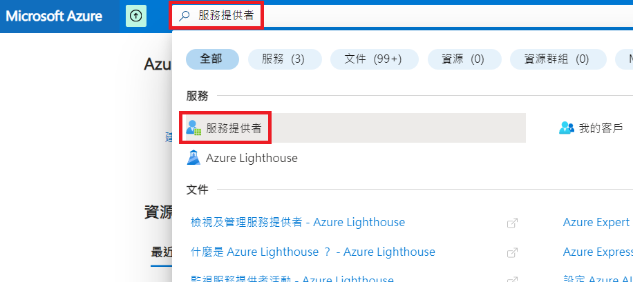
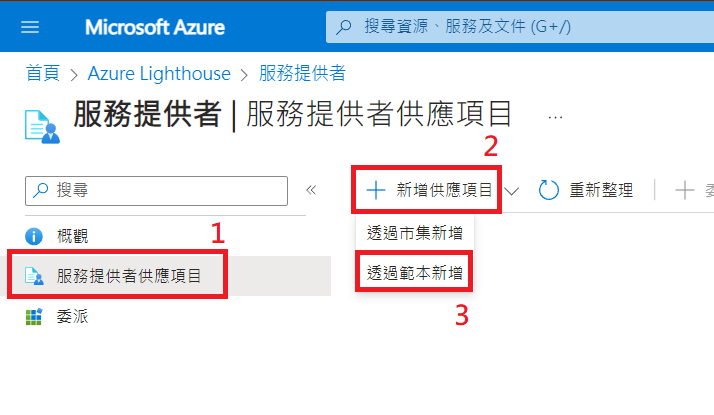
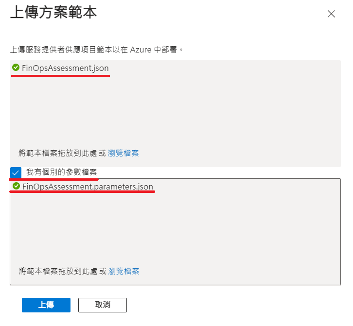
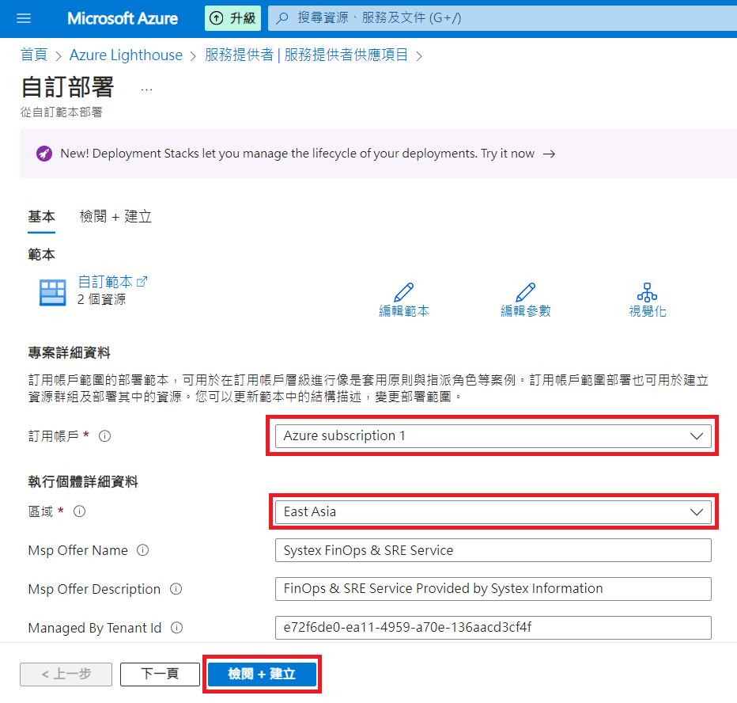
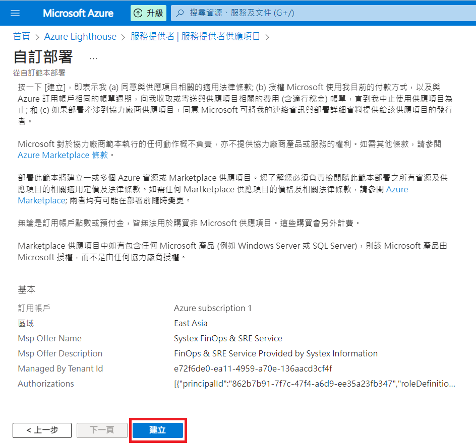
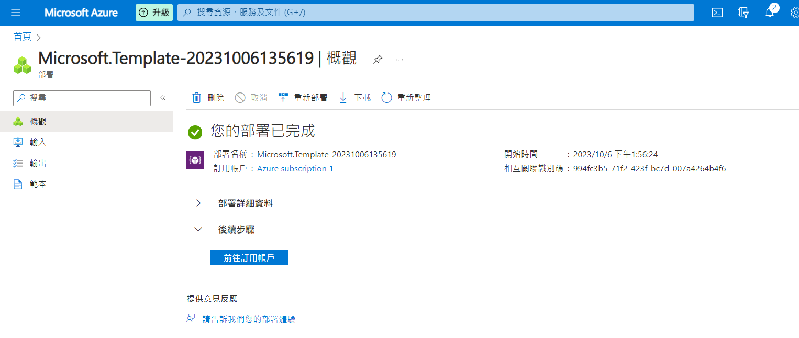
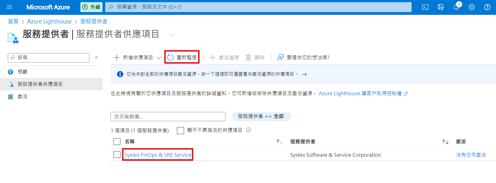

# 以AAD加入Systex FinOps & SRE的服務

為了提供Azure用戶最佳的FinOps & SRE服務，需要用戶以AAD（Azure Active Directory）加入我們的Azure Lighthoure，以利進行數據分析。

## 加入方式

1. 使用Powershell加入。
2. 使用Azure CLI加入。
3. 透過Azure 入口網站加入。

以上擇一進行即可。

## 前置準備

### 準備檔案

這三種方式都需要此目錄下的

1. FinOpsAssessment.json
2. FinOpsAssessment.parameters.json

關於此二文件：

1. 都不需任何修改，在後續流程直接引用即可。
2. 建議使用Download raw file的方式下載，如下圖，以確保檔名與內容正確。


### 確保操作權限

須以non-guest account進行操作，且須具有Microsoft.Authorization/roleAssignments/write的權限，詳見[Deploy the Azure Resource Manager template](https://learn.microsoft.com/en-us/azure/lighthouse/how-to/onboard-customer#deploy-the-azure-resource-manager-template)。

## 使用Powershell加入
1. 建立一個資料夾，並下載FinOpsAssessment.json與FinOpsAssessment.parameters.json至其中。
2. 在該資料夾底下開啟Powershell。
3. 輸入以下指令（須置換[`<AzureRegion>`](https://learn.microsoft.com/zh-tw/gaming/playfab/api-references/events/data-types/azureregion)）：
   > 須先使用Connect-AzAccount登入Azure帳戶才進行以下流程。
   ```powershell
   New-AzSubscriptionDeployment -Location <AzureRegion> `
                    -TemplateFile FinOpsAssessment.json `
                    -TemplateParameterFile FinOpsAssessment.parameters.json `
                    -Verbose
   ```
4. 確認是否加入成功：
   ```powershell
   Get-AzManagedServicesDefinition
   Get-AzManagedServicesAssignment
   ```

## 使用****Azure CLI****加入
1. 建立一個資料夾，並下載FinOpsAssessment.json與FinOpsAssessment.parameters.json至其中。
2. 在該資料夾位置開啟命令行介面。
3. 輸入以下指令（須置換[`<AzureRegion>`](https://learn.microsoft.com/zh-tw/gaming/playfab/api-references/events/data-types/azureregion)）：
   > 1. 須先登入Azure帳戶（az login）才能進行以下流程。
   > 2. 由於是以反斜槓換行故不可使用Powershell輸入）
   ```bash
   az deployment sub create --location <AzureRegion> \
                            --template-file FinOpsAssessment.json \
                            --parameters FinOpsAssessment.parameters.json \
                            --verbose
   ```
4. 確認是否加入成功：
   ```bash
   az managedservices definition list
   az managedservices assignment list
   ```

## 透過Azure入口網站加入
1. 選取Azure Lighthouse功能
   
2. 開啟上傳介面  
   
3. 上傳範本檔案（確保如附圖配置後按上傳）
   
4. 選擇訂閱帳戶與區域後按「檢閱 + 建立」鈕
   
5. 確認內容後按「建立」鈕
   
6. 等待部屬完成如下圖
   
7. 至Azure Lighthouse，即可看到（可能需要按重新整理）已成功加入Systex FinOps & SRE Service之服務🎉
   


## 參考資料
[Onboard a customer to Azure Lighthouse](https://learn.microsoft.com/en-us/azure/lighthouse/how-to/onboard-customer)

## 備註
1. 無論是使用Powershell或Azure CLI加入，都可以不填<deploymentName>，系統會自動產生。
2. Powershell登入Azure所使用的Connect-AzAccount是新模組Az module的功能，相關安裝請參考[Introducing the Azure Az PowerShell module](https://learn.microsoft.com/en-us/powershell/azure/new-azureps-module-az?view=azps-10.3.0)。